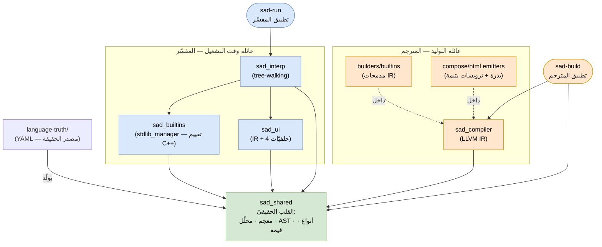
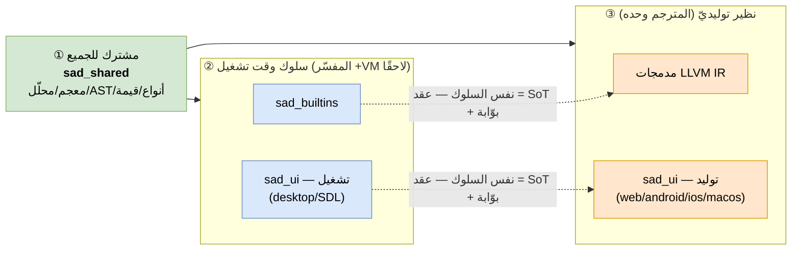
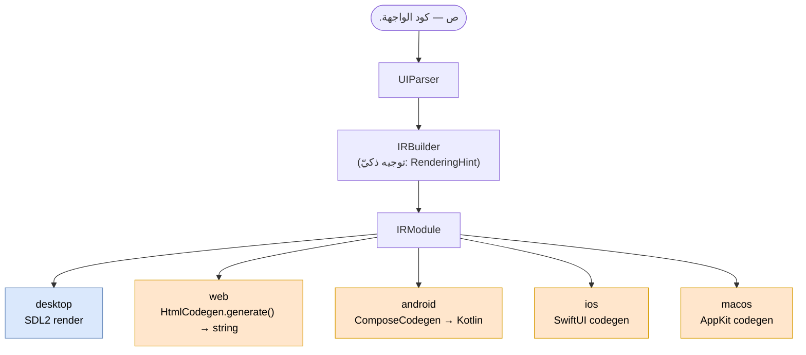
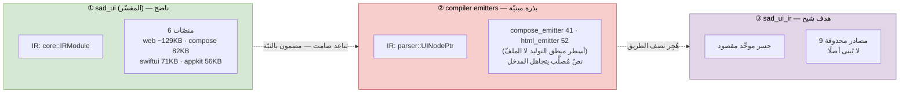
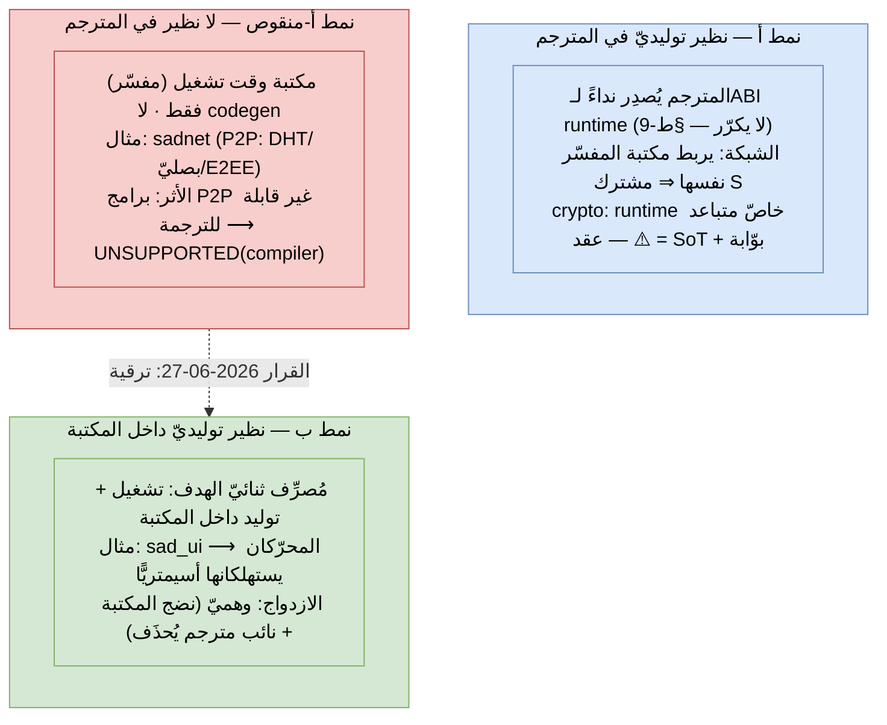
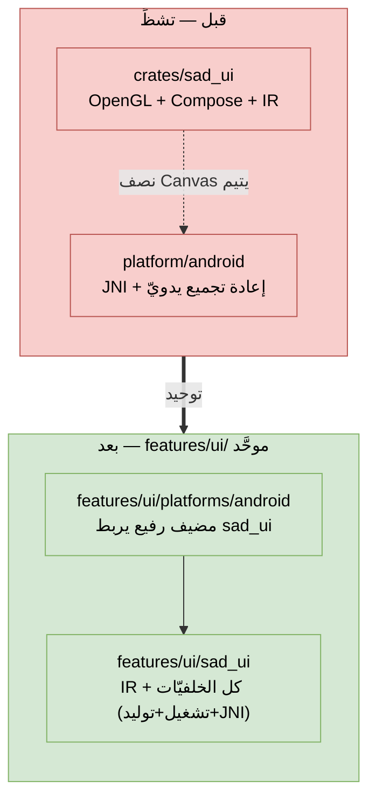
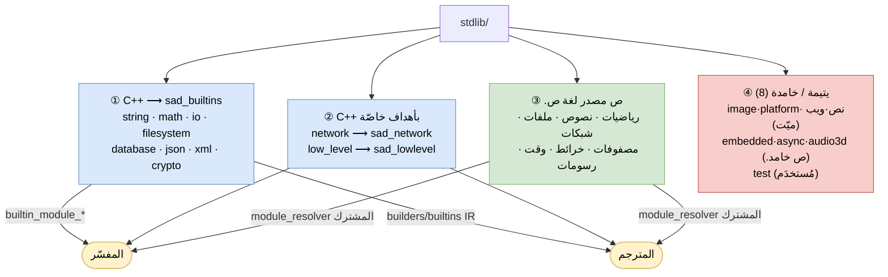
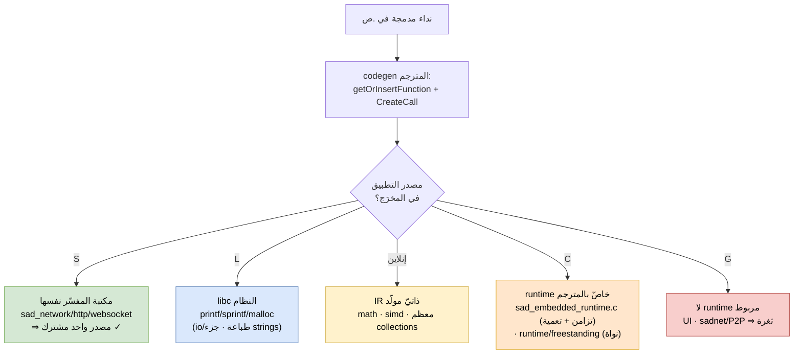
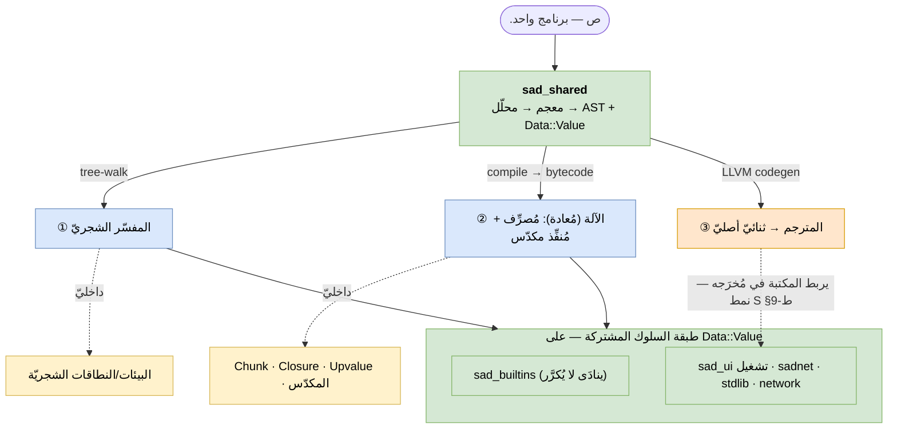
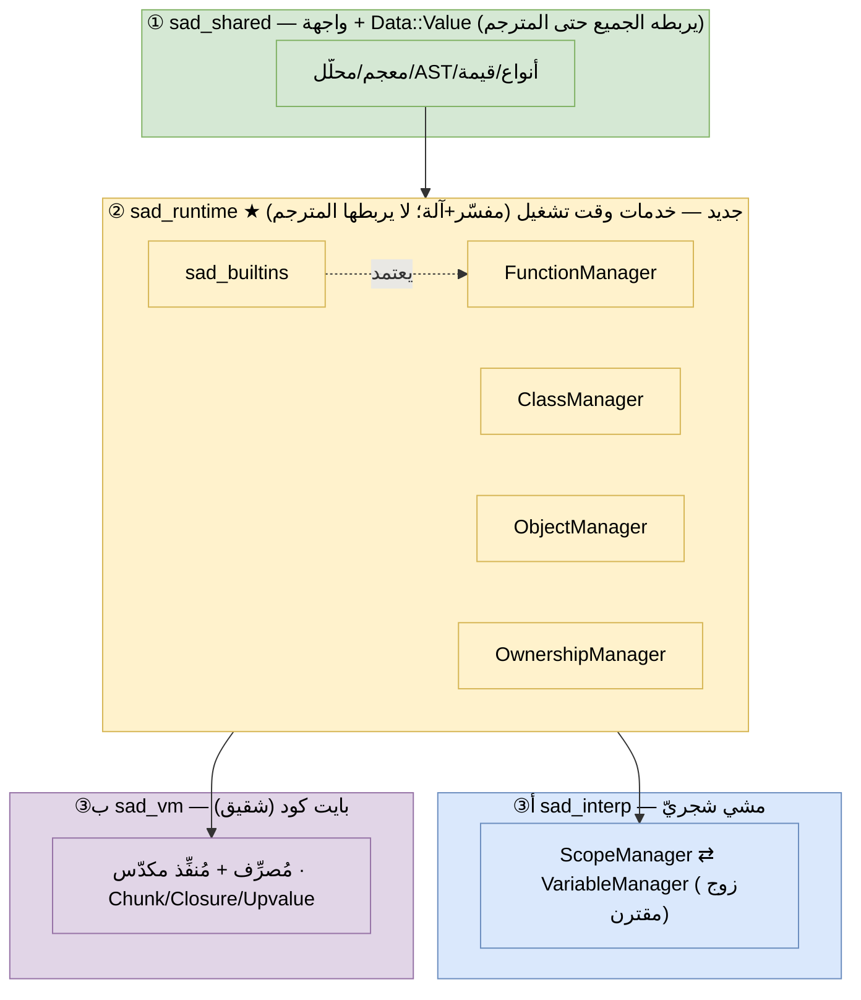

- **عنوان المقترح:** إعادة تنظيم القلب اللغويّ إلى مساحة عمل (workspace) واحدة بحدود وحدات داخلية صارمة — بدل تشظية المستودعات
- **النطاق:** لغة `text/` (يمسّ بنية مستودع الكود `s-programming-language` ونظام بنائه وبوّابات جودته)
- **تاريخ البدء:** 2026-06-25
- **رقم الـ RFC:** 10 (رقم الـ PR في `sadlang-rfcs`)
- **الحالة:** قيد التنفيذ (م0/م1/م2-أ مُنجَزة بالكامل؛ م2-ب/م2-ج جزئيًّا — PRs كود #92→#100؛ راجع **§ط** لحالة المراحل المُثبَتة بالكود)
- **Issue التتبُّع:** sadlang/s-programming-language (مراحل التنفيذ)
- **تحديث (2026-06-25):** تصحيح بعد فحص الكود الفعليّ — المستودع يحوي **ثلاثة محرّكات تنفيذ** لا اثنين (مفسّر شجريّ + آلة افتراضية `vm/` + مترجم)، وطبقة المدمجات الموحَّدة `sad_builtins` **هدفٌ لا واقع راهن** (الآلة الافتراضية تُعيد تطبيق المدمجات بقيمها الخاصّة). أُعيد ترتيب المراحل تبعًا لذلك (§ح)، وصارت المطابقة **ثلاثيّة** (§هـ).
- **تحديث (2026-06-27) — تحقّق ميدانيّ بالكود (`origin/dev` @ `ce463589`):** فحصٌ مباشر بعد دمج م0/م1/م2-أ/ب/ج صحّح فرضيّتين محوريّتين: **(1) المستودع صار محرّكَين لا ثلاثة** — حُذفت الآلة الافتراضية (#96) لإعادة كتابتها على `Data::Value`، فالمطابقة **ثنائيّة مؤقّتًا**. **(2) الفصل بين المحرّكَين قائمٌ بنيويًّا الآن** (المترجم لا يربط المفسّر)، لكنّ «تشارك `sad_builtins`/`sad_ui`» **غير قابل للتحقيق للمترجم** لأنه يولّد كودًا أصليًّا لا يستدعي دوال وقت التشغيل — فالعقد المشترك = **سجلّ SoT + بوّابة المطابقة، لا تطبيق مشترك**. كل الأدلّة بمراجع `ملف:سطر` في **§ط (ملحق التحقّق الميدانيّ)**.

# ملخّص

> فقرة واحدة تشرح الميزة باختصار. ماذا تقترح؟ وما النتيجة المرئية للمستخدم؟

نشأ اقتراح أوّليّ بفصل قلب لغة ص إلى مستودعات مستقلّة (`core` و`compiler` و`interpreter`…) «لتبدو لغةً عالمية المستوى مثل Rust وPython». يرفض هذا الـ RFC **التشظية الفيزيائية الآن**، ويستبدلها بما تفعله تلك اللغات فعلاً: **مساحة عمل واحدة (monorepo) بحدود وحدات داخلية صارمة**. المقترَح إعادة هيكلة `s-programming-language` إلى حِزَم ساكنة معزولة الترويسات — `sad_shared` (القلب)، `sad_builtins`، `sad_interp`، `sad_vm`، `sad_compiler`، `sad_lsp` — تحت منسّق بناء موحَّد (`x.py`) يبني محرّكات التنفيذ **الثلاثة** (مفسّر شجريّ + آلة افتراضية + مترجم) **ذرّيًّا في نفس التهيئة**، مدعومًا بمِشدّ مطابقة سلوكيّة **ثلاثيّة** (مفسّر ≡ آلة افتراضية ≡ مترجم بِتًّا بِتّ) وبوّابات CI متدرّجة. **(وسم: «الثلاثة/ثلاثيّة» هدفٌ نهائيّ؛ الواقع الحاليّ محرّكان ومطابقة ثنائيّة بعد تأجيل الآلة الافتراضية #96 — راجع §ط-5 و§ط-9.)** النتيجة المرئية: يختفي تذبذب Debug/Release، وتُفرَض حدود الوحدات حاسوبيًّا لا بالنيّة، ويبقى التغيير المتقاطع التزامًا ذرّيًّا واحدًا، ونحصل على معيار خروج موضوعيّ يقول — إن لزم لاحقًا — «صار الفصل الفيزيائيّ آمنًا الآن».

# الدافع (Motivation)

> لماذا نفعل هذا؟ ما المشكلات التي يحلّها؟ ما النتيجة المتوقّعة؟

الدافع المباشر طلبٌ بأن «تبدو لغة ص عالمية المستوى» عبر فصل مستودعاتها. لكن الأدلّة تقلب المقدّمة:

- **اللغات عالمية المستوى مونوريبو بأغلبية ساحقة.** `rust-lang/rust` مستودع واحد يضمّ `rustc` + المكتبة القياسية (`core`/`alloc`/`std`) + `cargo` (subtree) + `clippy`/`rustfmt` + `rust-analyzer` + أداة البناء `x.py`. `python/cpython` مونوريبو (المحلّل + VM + المكتبة + الوثائق). `golang/go` و`ziglang/zig` كذلك. الاستثناء الوحيد (Swift) متشظٍّ لأسباب تنظيمية موروثة، ومهندسوه أنفسهم يشتكون من بطء المساهمة بسببه.
- **السبب جوهريّ لا تجميليّ:** محرّكات التنفيذ **الثلاثة** في لغة ص — المفسّر الشجريّ والآلة الافتراضية (bytecode) والمترجم — **يجب أن تبقى متوافقة سلوكيًّا** (والآلة الافتراضية مؤجَّلة حاليًّا #96، فالفعّال محرّكان). **تصحيح (§ط-9):** «تشارك المدمجات» يتحقّق عبر **ربط مكتبة المفسّر في مُخرَج المترجم** (نمط S، كالشبكة)، لا عبر تطبيق واحد مُجمَّع في الجميع. هذا بالضبط القيد الذي يجعل المونوريبو القرار الصحيح: التغيير المتقاطع يبقى التزامًا ذرّيًّا واحدًا. الفصل يحوّله إلى رقصة إصدارات متقاطعة عبر مستودعات — أصعب مشكلة في الهندسة الموزّعة، نفرضها على أنفسنا مقابل لا شيء.
- **الواقع الراهن أخطر مما يبدو:** فحص الكود يكشف أنّ سلوك المدمجات والواجهات **ليس مشتركًا فعلًا** — المفسّر يطبّقه وقت التشغيل (`sad_builtins` + خلفيّة `sad_ui` التشغيليّة)، بينما المترجم **يولّده** كودًا أصليًّا (مدمجات IR + خلفيّات توليد). أي أنّ التوافق السلوكيّ بين المحرّكَين يقوم اليوم على **اتّفاق نيّة لا تشارك كود** — مصدر تباعد صامت حقيقيّ. والمترجم **لا يمكنه** ربط تطبيق المفسّر (يولّد لا يستدعي)؛ فالعلاج ليس «هدف `sad_builtins` واحد يستهلكه الجميع» بل **استخراجه لعائلة وقت التشغيل** (أُنجِز #97) **+ عقد مطابقة من SoT وبوّابة** يربط المولّد بالمطبِّق (المرحلة 2). هذا **شرط مسبق** لأيّ مطابقة ذات معنى، لا نتيجة جانبيّة.
- **الجذر الحقيقيّ ليس «مستودع واحد»، بل مونوريبو غير منظَّم داخليًّا:** بقايا خطّ مترجم مؤرشف (`archived/compiler_pipeline_legacy`)، وانفصال CMake عن `shared/builtins` يولّد تحذيرات «غير معرّف» كاذبة في الـLSP، وانحراف طبقة ذكاء الـLSP عن مصدر الحقيقة (16/1073 مدمجة مهرّدة يدويًّا).
- **عثرات بناء موثَّقة أهدرت جلسات كاملة:** الـrunner ينكسر حين يتباعد Debug/Release بين المفسّر والمترجم؛ وفخّ «الثنائيّ البائت» (`sad-build.exe` يجب نسخه يدويًّا إلى `sadc.exe`)؛ وسباق حالة مشتركة على `FunctionManager` لم يُكتَشف إلا لأن كل شيء يُبنى ويُختبر معًا.

النتيجة المتوقّعة: حدودٌ معمارية واضحة (المظهر «العالميّ» الحقيقيّ)، وقتلٌ لصنف كامل من النتائج الكاذبة، وأصلٌ اختباريّ (مِشدّ المطابقة) يجعل أيّ فصلٍ مستقبليّ — إن طُلب — عمليّةً مملّةً آمنة لا قمارًا سلوكيًّا.

# الشرح التوجيهي (Guide-level explanation)

> اشرح المقترح كما لو كنت تعلّمه لمستخدم آخر للغة ص.

بالنسبة لمن يكتب برامج `.ص`، **لا يتغيّر شيء في اللغة نفسها** — لا صياغة جديدة ولا سلوك جديد. التغيير كلّه في كيفية تنظيم مستودع المُنفِّذ وبنائه واختباره. لكن أثره غير المباشر ملموس:

- **بناء أبسط وأوثق:** بدل تذكُّر أيّ تهيئة بُني بها المفسّر مقابل المترجم، يصبح هناك أمرٌ واحد:

  ```sh
  python x.py build --config Debug,Release   # يبني المفسّر والمترجم معًا، ذرّيًّا
  python x.py test                           # يبني (إن لزم) ثم يشغّل الـrunner
  python x.py conformance                     # يثبت تطابق المفسّر والمترجم
  ```

- **رسائل أخطاء أصدق:** إن حُمّل ثنائيّ بتهيئة غير متوقّعة، يفشل الـrunner فورًا برسالة صريحة («تهيئة المفسّر Debug لا تطابق المترجم Release») بدل إعطاء نتيجة بائتة صامتة.
- **عدم الدعم يصبح مرئيًّا لا مخفيًّا:** الميزة غير المدعومة بعدُ في المترجم تُسجَّل صراحةً `UNSUPPORTED(compiler, NS-06)` بدل `@skip_compiler` صامت — فتتحوّل الثغرة من مخفيّة إلى محصورة معدودة مربوطة بـRFC.

# الشرح المرجعي (Reference-level explanation)

> التفاصيل التقنية الدقيقة، موجّهة لمن سيُنفّذ المقترح.

## أ) المخطّط الشجريّ المقترح (حِزَم CMake ساكنة)

```
s-programming-language/
├── x.py                      # المنسّق الموحَّد (البوّابة الوحيدة للبناء)
├── CMakeLists.txt            # الجذر: add_subdirectory + خيارات عامّة فقط
├── language-truth/           # ★ مصدر الحقيقة الوحيد (YAML) — لا كود C++
│   └── generators/           # gen_*.py …
├── crates/
│   ├── sad_shared/           # ★ القلب اللغويّ الحقيقيّ: معجم/محلّل/AST/أنواع/قيمة — يربطه الجميع
│   │   ├── include/          #   ★ الترويسات العامّة (المُصدَّرة) — تُولَّد من language-truth
│   │   ├── src/              #   التنفيذ + ترويسات خاصّة (لا تُصدَّر)
│   │   └── CMakeLists.txt    #   add_library(sad_shared STATIC …)
│   ├── sad_runtime/          # ★ خدمات وقت التشغيل (مفسّر + آلة؛ لا يربطها المترجم) — §ط-10:
│   │   ├── builtins/         #   sad_builtins (تقييم C++ على Data::Value)
│   │   └── managers/         #   FunctionManager · ClassManager · ObjectManager · OwnershipManager (مُستخرَجة من interpreter/ ⇒ تسدّ تسرّب §ط-5)
│   ├── sad_interp/           # المحرّك 1: مفسّر شجريّ — يستهلك sad_runtime
│   │   ├── managers/         #   ScopeManager ⇄ VariableManager (شجريّان، للمفسّر وحده — §ط-10)
│   │   └── ui/               #   استهلاك خلفيّة desktop التشغيليّة من sad_ui (§ط-7)
│   ├── sad_vm/               # المحرّك (مؤجَّل #96، يُعاد على Data::Value) — شقيقٌ، يستهلك sad_runtime
│   ├── sad_compiler/         # المحرّك: مترجم LLVM IR — لا يربط sad_runtime (يربط مكتباته في مُخرَجه §ط-9)
│   │   ├── builtins_ir/      #   نظير توليديّ للمدمجات (يُصدِر نداءً/IR لا إعادة تطبيق)
│   │   └── ui_ir/            #   جسر ⟶ خلفيّات توليد sad_ui (لا إعادة تطبيق)
│   └── sad_lsp/              # طبقة الذكاء — تستهلك sad_shared فقط
├── apps/
│   ├── sad-run/              # يستضيف المفسّر (+الآلة الافتراضية لاحقًا) (main رفيع)
│   └── sad-build/            # ثنائيّ المترجم (main رفيع)
├── features/
│   ├── ui/                   # ★ كل ما يخصّ الواجهات تحت سقف واحد (توحيد التشظّي — §ط-7):
│   │   ├── sad_ui/           #   المُصرِّف ثنائيّ الهدف: IR + كل الخلفيّات (تشغيل desktop/JNI | توليد web/android/ios/macos)
│   │   └── platforms/        #   مضيفات نشر رفيعة تربط sad_ui: android (sad_app يُضمِّن المفسّر)، ios…
│   ├── network/              # كلاسيكيّ (TCP/UDP/HTTP) + sadnet (P2P، يُرقَّى لنمط ب — §ط-6)
│   └── stdlib/               # مكتبة ص القياسيّة
├── tools/                    # أدوات أوراق ⟶ sad_shared: lsp، formatter، repl، sadinfo، docs (توثيق→HTML/PDF)… + layering_lint.py
├── tests/  { unit/ (محاذاة للحِزَم)  conformance/ (المِشدّ)  grammar/ }
└── archived/                 # يُفرَّغ تدريجيًّا (المرحلة 5)
```

> **تصحيح الجرد (2026-06-27، مُثبَت بالكود — §ط):** ثلاثة تصويبات على الشجرة الأصليّة:
> 1. **القلب الحقيقيّ اسمه `sad_shared` لا `sad_core`** — فالأخير (بعد رنيمة #100) هو اسم *المفسّر* (`add_library(sad_core ALIAS sad_interp)`). القلب اللغويّ المشترك = `sad_shared` (`shared/CMakeLists.txt:10`).
> 2. **`sad_builtins` و`sad_ui` ليسا «مشتركَين للمحرّكات» بل عائلة وقت التشغيل** — يستهلكهما المفسّر؛ المترجم له نظيرٌ توليديّ يحاكي السلوك (مدمجات IR، وخلفيّات توليد `sad_ui`). فموضعهما تحت المفسّر/سلوك وقت التشغيل، لا مستوًى شقيقًا يوحي بمشاركة الجميع.
> 3. **محرّكان لا ثلاثة** — حُذفت الآلة الافتراضية (#96)، تُعاد لاحقًا.
>
> **تمييز مهمّ (لئلّا يُخلَط):** «مصدّرات HTML» نوعان منفصلان — (أ) **توليد واجهات** (`compiler/src/backend/html_emitter.cpp` و`compose_emitter.cpp`: أزرار/مدخلات/`component_json`)؛ (ب) **توليد توثيق اللغة** (`compiler/src/meta/docs_emitter_html.cpp`: نظام إخراج توثيق ص إلى HTML/PDF، يملكه المحرّكان عبر `main_simple.cpp`/`compiler_driver_frontend.cpp`). النظامان لا يتقاطعان (التوثيق لا يلمس `HtmlEmitter`).

المبدأ الحاكم: **المصدر المولَّد من القواعد يُكتَب داخل `sad_shared/include` (القلب — لا `sad_core`=المفسّر) كأثر بناء، لا يُحرَّر يدويًّا** — فيختفي انفصال CMake عن المصدر المولَّد (أحد أسباب تحذيرات LSP الكاذبة).

## ب) قواعد الاعتماد (الحوافّ المسموحة والممنوعة)

> **⚠️ وسم (§ط-9):** صياغة «المترجم يولّد مدمجاته IR» أدناه مبسَّطة — الواقع: يُصدِر **نداءً** لـABI ويربط **مكتبة المفسّر نفسها** في مُخرَجه حيث أمكن (الشبكة = نمط S مشترك). راجع §ط-9 للمحور الدقيق S/L/C/G.

```
   language-truth  ──(يولّد)──▶  sad_shared  ◀──  sad_lsp
                                   ▲   ▲   ▲   ▲
              ┌────────────────────┘   │   │   └────────────────┐
              │      ┌─────────────────┘   └──────┐             │
        sad_builtins │                            │             │
              ▲      │  sad_ui (تشغيل│توليد)        │             │
              │      │     ▲ تشغيل      ▲ توليد      │             │
              └──── sad_interp ────┘    └──── sad_compiler ──────┘
                    ▲ (عائلة وقت التشغيل)        ▲ (عائلة التوليد)
                 sad-run                      sad-build
```

> النموذج المُثبَت بالكود مرسومٌ غنيًّا في **§ط-1**؛ هذا تجريدٌ له. المترجم **لا** يربط `sad_interp`/`sad_builtins`؛ ويستهلك `sad_ui` عبر خلفيّات التوليد فقط (جسرًا)، لا خلفيّة التشغيل.

القاعدة الموجبة (مصحَّحة 2026-06-27):
- `sad_shared` لا يعتمد على شيء (إلا القياسيّ) — وهو وحده المشترك بين المحرّكَين.
- `sad_builtins` ⟶ `sad_shared` فقط، **ويستهلكه `sad_interp` وحده** (عائلة وقت التشغيل +VM لاحقًا). المترجم **لا يربطه**؛ بل يولّد مدمجاته IR — فالعقد بينهما = سجلّ SoT + بوّابة المطابقة، لا تطبيقٌ مشترك.
- `sad_interp` ⟶ `sad_shared` + `sad_builtins` + خلفيّة `sad_ui` التشغيليّة.
- `sad_compiler` ⟶ `sad_shared` + خلفيّات `sad_ui` التوليديّة (عبر جسر `ui_ir`). لا يربط `sad_builtins` ولا `sad_interp`.
- `sad_ui` ⟶ `sad_shared` فقط؛ مُصرِّف ثنائيّ الهدف يستهلكه المحرّكان **أسيمتريًّا** (تشغيل ↔ توليد).
- `sad_lsp` ⟶ `sad_shared` فقط (يعيد استخدام المحلّل الحقيقيّ بدل ترهيد يدويّ — يعالج انحراف LSP عن مصدر الحقيقة).

> **تصحيح (2026-06-27، بعد #97):** هدف `sad_builtins` **استُخرِج فعلًا** (`cmake/libraries.cmake:36`) — لكنّ المخطّط أعلاه يبقى **مضلِّلًا**: المستهلك الوحيد هو المفسّر (`sad_interp PUBLIC sad_builtins`، `:41`)، و**المترجم لا يربطه ولن يربطه** — فهو يولّد مدمجاته IR في `compiler/src/backend/llvm/builders/builtins/`. أي إنّ بند «الثلاثة تتشارك `sad_builtins` بالضبط» **غير قابل للتحقيق للمترجم بنيويًّا**؛ المشترك الحقيقيّ = سجلّ SoT (`builtin_registry.h`) + بوّابة المطابقة، لا تطبيقٌ واحد. الحافّة الصحيحة: `sad_builtins ⟶ sad_interp` فقط (وVM لاحقًا). التفصيل والأدلّة في **§ط-1/§ط-2**.

الحوافّ **الممنوعة** (يفشل البناء عندها):
- أيّ حافّة مباشرة بين المحرّكَين `sad_interp ↔ sad_compiler` (وأيّ `sad_vm` لاحقًا) — أيّ تسريب = تباعد سلوك. **حارس حدّ المفسّر القائم (#100) يفرض هذا جزئيًّا** (`check_interpreter_boundary.py`).
- `sad_compiler ⟶ sad_builtins` — ممنوع مبدئيًّا: المترجم يحاكي المدمجات توليدًا لا يربطها (لو رُبط لأعاد تطبيقًا مزدوجًا صامتًا).
- أيّ شيء ⟶ `sad-run`/`sad-build` (الثنائيّات أوراق، لا تُستورَد).
- `sad_lsp ⟶` أيّ منفّذ (`sad_interp`/`sad_compiler`/`sad_builtins`/`sad_ui`).
- أيّ `#include` يصل إلى `crates/X/src/**` من خارج X (الوصول للأحشاء). **تسرّب كامن راهن:** `sad_shared` يصدّر `interpreter/include` توافقيًّا — يجب تقليمه (راجع §ط-5).

## ج) المنسّق الموحَّد `x.py` (البوّابة الوحيدة)

التزاماته الصلبة:
1. **يبني المفسّر والمترجم دائمًا في نفس التهيئة في خطوة واحدة.** إن طُلبت تهيئتان، تُبنيان كلتاهما بالكامل قبل أيّ اختبار — فيستحيل أن يقرأ الـrunner مفسّرًا Debug ومترجمًا Release.
2. **يملك أسماء الأهداف مركزيًّا** (`sad-run`/`sad-build`) — تنتهي churn اسم الهدف عبر CI والسكربتات.
3. **ينسخ/يربط الثنائيّات إلى مسار `dist/` ثابت** يقرؤه الـrunner — يُبطل فخّ «انسخ `sad-build.exe` إلى `sadc.exe`».
4. **مرحلة توليد القواعد تسبق التصريف وتفشل البناء عند انجراف المُولَّد** عن مصدر الحقيقة.

## د) فرض الحدود ميكانيكيًّا (ثلاث طبقات، الأخفّ أولًا)

1. **عزل الترويسات:** كل crate `STATIC` مع `src/` في `PRIVATE` فقط، فالوصول للأحشاء **يفشل التصريف** تلقائيًّا (المثال أدناه **تخطيطيّ** لا حرفيّ — الربط الحيّ `sad_interp PUBLIC sad_builtins`، `cmake/libraries.cmake:41`):

   ```cmake
   # (القلب الحقيقيّ = sad_shared لا sad_core — راجع §ط-1؛ sad_core صار ALIAS للمفسّر #100)
   target_include_directories(sad_shared
     PUBLIC  ${CMAKE_CURRENT_SOURCE_DIR}/include
     PRIVATE ${CMAKE_CURRENT_SOURCE_DIR}/src)
   target_link_libraries(sad_interp PRIVATE sad_shared sad_builtins)
   ```

2. **دالة CMake مغلِّفة `sad_add_crate()`** تسجّل اعتمادات كل crate، وفحص الإعداد يرفض أيّ حافّة خارج المصفوفة المسموحة (ب).
3. **`tools/layering_lint.py`** (يستدعيه `x.py lint-layers` وCI): يمسح كل `#include`، يبني رسم الاعتماد الفعليّ، ويطابقه على المصفوفة؛ أيّ حافّة زائدة = فشل. شبكة أمان تلتقط ما يتسرّب عبر مسارات غير متوقّعة.

## هـ) مِشدّ المطابقة السلوكيّة الثلاثيّة (الأصل الأغلى)

> **تصحيح (2026-06-27):** بعد حذف الآلة الافتراضية (#96)، المطابقة الفعليّة اليوم **ثنائيّة** (مفسّر ≡ مترجم) لا ثلاثيّة. تبقى الصياغة «الثلاثيّة» هدفًا يُستأنَف حين يُعاد بناء الآلة الافتراضية على `Data::Value`. البوّابة الحاليّة تشخيصيّة ثنائيّة عند 92.8% (عتبة 86%). راجع §ط-5.

**نفس البرنامج، عبر محرّكات التنفيذ (حاليًّا: مفسّر + مترجم؛ هدفًا: +آلة افتراضية حين تُعاد)، يجب أن يُنتج نفس المخرج بِتًّا بِتّ.** يُعمَّم المِشدّ من «زوج» إلى **مجموعة محرّكات**؛ والبذرة قائمة فعلًا: `cmake/dual_tests.cmake` (ADR-03) يشغّل «التنفيذ المزدوج مفسّر↔مترجم» عبر `runner.py` بمستويات P0/P1/P2 — يُعمَّم بإضافة محرّك الآلة الافتراضية (`--engine vm`) حين يُعاد بناؤه على `Data::Value`.

- **العَرّاف (oracle):** المفسّر الشجريّ مرجع؛ الشرط `vm ≡ مفسّر` **و** `مترجم ≡ مفسّر` ⇒ تعدٍّ `vm ≡ مترجم`. عند الاختلاف يُحدَّد المحرّك الشاذّ بالأغلبية.
- **مجموعة برامج ذهبيّة (golden corpus)** مشتقّة آليًّا من خطّ القواعد (104 قاعدة) ومن مصفوفة TEST-008 (166 زوجًا مشتقًّا بـ ADR-005) عبر `gen_rules_matrix.py` — لا تُكتَب يدويًّا.
- **عقد التشغيل لكل برنامج:** `(stdout, تصنيف-stderr, exit-code, آثار جانبيّة مرصودة)`. تصنيف الخطأ (مثل `SEM004`) جزء من العقد — وإلا فرّ سباق `FunctionManager` من الشبكة ثانيةً.
- **حالة «غير مدعوم» لكلّ محرّك على حدة:** تُسجَّل صراحةً `UNSUPPORTED(vm, Y)` و`UNSUPPORTED(compiler, Y)` معدودَين منفصلَين بـ ratchet مستقلّ لكلٍّ — فلا يختبئ عجز الآلة الافتراضية خلف عجز المترجم.
- التغطية الأساس الواقعيّة: **166 زوجًا + 249 منفردة** برامج عقد؛ المتبقّي المعلوم (127 زوجًا) عجزٌ معدود لا مجهول.
- **تصنيف `DIVERGENT` (أخطر من `UNSUPPORTED`):** `UNSUPPORTED(engine, key)` = المحرّك **لا يُنتج** (عجز صريح مرئيّ). أمّا `DIVERGENT(engine, key)` = المحرّك **يُنتج ناتجًا مختلفًا عن العَرّاف صامتًا** (سلوك خاطئ مموَّه) — وهو الأخطر لأنّه يمرّ ما لم يختبر المِشدّ صحّة الناتج بِتًّا. كلاهما معدودٌ بـ ratchet مستقلّ.
- **العجز المعدود المُسجَّل حاليًّا (مكتشَف بالفحص الميدانيّ §ط-9):**
  | المفتاح | التصنيف | السبب | الأثر |
  |---|---|---|---|
  | `DIVERGENT(compiler, crypto)` | ⚠️ تباعد صامت | المفسّر تعمية حقيقيّة (SHA-256/AES/X25519)؛ مُخرَج المترجم لعبة (FNV-1a/XOR، `tools/compiler/runtime/sad_embedded_runtime.c:477,497`) | نفس `شفّر(...)` ناتجان مختلفان — **أولويّة قصوى** |
  | `UNSUPPORTED(compiler, UI)` | عجز صريح | رموز `sad_button`/`sad_app_create` غير مربوطة في أيّ `compiler_driver` (`runtime/sad_ui_runtime.cpp:173,453`) | برامج الواجهات لا تعمل مُترجَمةً |
  | `UNSUPPORTED(compiler, P2P)` | عجز صريح (عميق) | لا opcode لـ`sadnet` في الـbackend أصلًا | برامج `استورد شبكة_لامركزية` غير قابلة للترجمة |
  > **بوّابة فرعيّة لازمة:** يجب أن يحوي المِشدّ برامجَ عقدٍ **تختبر صحّة التعمية بِتًّا** (لا مجرّد عدم الانهيار)، وإلا بقي `DIVERGENT(compiler, crypto)` مخفيًّا. هذا شرط قبول قبل إعلان أيّ نسبة مطابقة ذات معنى للتعمية.

> **شرط مسبق حاسم (مُصحَّح 2026-06-27):** المِشدّ المفروض **لا** يقوم على «تطبيق مدمجات مشترك بين الجميع» — فالمترجم يولّد مدمجاته IR ولا يربط `sad_builtins` أبدًا (§ط-2). يقوم بدلًا منه على **عقدٍ من SoT** (`builtin_registry.h` المولَّد) **+ بوّابة سلوكيّة**. لذا المِشدّ **على مرحلتين**: (1) **تشخيصيّ** مبكر يوثّق التباعد عجزًا معدودًا (قائم — #95)؛ (2) **مفروض** (G2/G3) بعد نضج البوّابة وإعادة الآلة الافتراضية. ملاحظة: `sad_builtins` استُخرِج فعلًا (#97) لعائلة وقت التشغيل، لا للجميع.

## و) بوّابات CI — مرتّبة بتخفيض-المخاطرة-لكلّ-جهد

> **وسم (2026-06-27):** الجداول أدناه تصف **الهدف النهائيّ ثلاثيّ المحرّكات**. الواقع الحاليّ **ثنائيّ** (مفسّر≡مترجم) بعد تأجيل الآلة الافتراضية (#96)، فاقرأ `{مفسّر، آلة، مترجم}` و«ثلاثيّة» أدناه على أنّها الهدف؛ المفروض حاليًّا زوج، ويُضاف المحرّك الثالث حين يُعاد بناؤه. التصنيفان `UNSUPPORTED`/`DIVERGENT` معدودان فعليًّا (راجع §هـ و§ط-9).

| # | البوّابة | معيار النجاح/الفشل |
|---|----------|---------------------|
| **G1** | مصفوفة كاملة: بناء `{مفسّر, آلة افتراضية, مترجم} × {Debug, Release}` وتشغيل المِشدّ على تركيباتها + بصمة hash لكل ثنائيّ | تطابق كل محرّك عبر تهيئتيه، وبصمات صحيحة؛ سلوك Debug ≠ Release = عيب |
| **G2** | مطابقة ثلاثيّة `مفسّر≡آلة افتراضية≡مترجم` على الأساس | 0 اختلاف غير مُصنَّف؛ كل عدم-دعم `UNSUPPORTED(engine,key)` وكل تباعد `DIVERGENT(engine,key)` معدود لكلّ محرّك (يشمل اختبار صحّة التعمية بِتًّا) |
| **G3** | منع التراجع (ratchet) لكلّ محرّك | عدد المتطابقة لا ينقص؛ عدد `UNSUPPORTED` و`DIVERGENT` لا يزيد لأيّ محرّك؛ `DIVERGENT` لا يُضاف إلا موثَّقًا بـRFC مع خطّة سدّ |
| **G4** | اختبارات حدود الوحدات (عقود consumer-driven عند كل حدّ) | كل عقد حدّ أخضر؛ اختبار «لا تسرّب مباشر بين المحرّكَين `sad_interp ↔ sad_compiler` (+`sad_vm` لاحقًا)» أخضر — يفرضه حارس حدّ المفسّر (#100) جزئيًّا |
| **G5** | موازنة التذبذب (flakiness budget) | معدّل الفشل غير الحتميّ < 0.5%؛ المتذبذب يُوسَم ويُحجَب الدمج عليه |
| **G6** | بوّابة تغطية مصفوفة القواعد (TEST-008، البوّابة الرابعة القائمة) | لا تراجع في التغطية |

## ز) الأثر على الأنظمة المتشابكة

> **⚠️ وسم (§ط-9):** عبارات «المترجم يولّد نظيره/يحاكي ولا يربط» في هذا القسم **مبالغة** — المحور الدقيق هو **مصدر التطبيق في مُخرَج المترجم** (S مشترك / L libc / C خاصّ / G ثغرة): الشبكة مشتركة (يربط `sad_network` نفسها)، التعمية خاصّة متباعدة، UI/P2P ثغرتان. اقرأ §ط-9 قبل اعتماد هذا القسم.

- **مصدر الحقيقة (`language-truth/`):** لا كلمات/أنواع/أخطاء جديدة. يصبح المصدر الوحيد الذي تتولّد منه ترويسات `sad_shared` (القلب — لا `sad_core`=المفسّر) وبرامج المِشدّ.
- **المحلل المعجمي/النحوي وAST:** يُنقَلان إلى `sad_shared` (القلب الحقيقيّ — §ط-1؛ لا `sad_core` فهو اسم المفسّر بعد #100) دون تغيير منطقيّ.
- **محرّكات التنفيذ (مفسّر/مترجم، +آلة افتراضية لاحقًا):** تُغلَّف وراء حدود `sad_interp`/`sad_compiler` (+`sad_vm`). **عائلة وقت التشغيل (مفسّر +VM) تتشارك `sad_builtins`؛ المترجم لا يربطه بل يولّد نظيره IR** — التطابق مضمونٌ بعقد SoT+بوّابة لا بكود مشترك (§ط-2). لا تغيير في الدلالات.
- **الرسومات ووقت التشغيل (`sad_ui`/`runtime`/`network`/`stdlib`):** `sad_ui` **مُصرِّف واجهات ثنائيّ الهدف** (§ط-3): المفسّر يستهلك خلفيّته التشغيليّة (desktop/SDL)، والمترجم خلفيّاته التوليديّة (web/android/ios/macos) عبر جسر `ui_ir` — **لا «نسخة واحدة يربطها الجميع»** (المترجم لا يربط خلفيّة التشغيل). بقيّة مكتبات وقت التشغيل (`runtime`/`network`/`stdlib`) عائلة المفسّر. (فُكّ تشابك `sad_ui` عن القلب فعلًا في م2-أ #94؛ والقلب اسمه `sad_shared` لا `sad_core`.)
- **نظام الأخطاء:** لا رموز جديدة؛ لكن تصنيف الخطأ يصبح جزءًا من عقد المطابقة لكلّ محرّك.
- **الأدوات (~16):** يُعاد توصيلها إلى `sad_shared` الحقيقيّ (القلب — لا `sad_core`=المفسّر) كأوراق (الـLSP يُغلِق انحرافه)؛ ويصبح `x.py` نقطة الدخول للبناء/الاختبار/التوليد.
- **التوافق الخلفي:** لا يكسر أيّ برنامج `.ص` قائم — التغيير في بنية المستودع لا في اللغة.

## ح) تسلسل الترحيل المرحليّ (كل مرحلة قابلة للشحن وحدها، كلٌّ = RFC تنفيذ/قفل وكيل عبر worktree + PR)

> **إعادة ترتيب (تصحيح بعد فحص الكود):** أُعيد ترتيب المراحل حول حقيقتين اكتُشِفتا: (1) لا هدف `sad_builtins` موحَّد، فالمطابقة المفروضة لا معنى لها قبل التوحيد؛ (2) `sad_core` يربط `sad_ui` عكسيًّا، ففكّه شرط مسبق. صارت المرحلة 2 «توحيد + فكّ تشابك» (الأساس الحرج) مقسَّمة، والمِشدّ على مرحلتين.

- **المرحلة 0 ↔ G1 — المنسّق دون نقل ملفّات.** ✅ **مُنجَزة (PR كود #92):** `x.py` يبني المحرّكات في نفس التهيئة ذرّيًّا وينسخ إلى `dist/` ببصمات، وحارس `verify`. مات تذبذب Debug/Release وفخّ `sadc.exe`. (توسيع مصفوفة الآلة الافتراضية يكتمل مع م3.)
- **المرحلة 1 — المصدر المولَّد ⟵ مصدر الحقيقة YAML.** 🔄 جارية. **تصحيح:** «نقل المصدر المولَّد للقواعد» لا ينطبق (لا `gen_grammar.py`؛ نطاق grammar مُعطَّل). المشكلة الحقيقيّة: 6 ملفّات مولَّدة (keywords/types/builtins/errors) **متعقَّبة** بينما YAML مصدرها. الحلّ **حارس انجراف** (`x.py gen --check` في CI) لا إلغاء تعقّب (يكشف الاختبار أنّ الأخير يتطلّب جراحة ترتيب بناء). مستقلّة تمامًا ⇒ تمشي بالتوازي.
- **المرحلة 2 — التوحيد وفكّ التشابك (الأساس الحرج).** ثلاث خطوات مرتّبة:
  - **2-أ:** فكّ `sad_ui` عن `sad_core` (إزالة اعتماد القلب على الرسومات — شرط مسبق).
  - **2-ب (أُنجِز #97):** استُخرِج `sad_builtins` في **هدف ساكن حقيقيّ** تستهلكه **عائلة وقت التشغيل** (المفسّر +VM لاحقًا) — لا المترجم (يولّد نظيره IR). كُسِرت دورة `FunctionManager`، ورُبِط CMake بـ`shared/builtins` صراحةً (`cmake/libraries.cmake:36`). **هذه البوّابة الحقيقيّة** التي يصير بها العقد (SoT + بوّابة) قابلًا للفرض هيكليًّا.
  - **2-ج:** استخراج `sad_core` وراء `include/` عامّ + `src/` خاصّ. تفعيل الطبقتين (د-1)+(د-2).
- **المرحلة 3 ↔ G4 — فصل المحرّكَين.** ✅ **منجزة (عدا تأجيلين)** عبر سلسلة PRs كود: حارس طبقات الربط `check_layering.py` + workflow (#106)؛ نقل `main` إلى `apps/` رفيعَين (`apps/sad-run` + `apps/sad-build`، حدّ الطبقة L2) (#107)؛ استخراج طبقة **`sad_runtime`** (function/object/ownership managers من `sad_core`، يربطها `sad_interp` PUBLIC اتّجاهًا أحاديًّا — موضع شقيق الآلة الافتراضية القادمة) عبر تقليم #108 ثمّ خطوات النقل #110، ونقل ترويسة `ClassManager` إلى `shared/types/`. **إغلاق تسرّب ترويسات المفسّر على البابين:** (أ) تصدير `sad_shared` PUBLIC (#110)، (ب) الكتلة العامّة `include_directories(interpreter/include*)` نُقلت إلى `sad_interp PUBLIC`/`sad_runtime PRIVATE` + نقل `user_thrown.h`→`shared/errors/include` (#112) ⇒ نظام المترجم لم يَعُد يرى ترويسات المفسّر **بنيويًّا**. **إصلاح CI:** بوّابة التنفيذ المزدوج كانت تتخطّى صامتةً على ويندوز (لا `sad-build` بلا LLVM-dev) ⇒ صارت تشغّل وضع المفسّر-فقط بدل التخطّي (#112). تلميع مراجعة (34 تصحيحًا، #113). البوّابة المزدوجة 95.4% (1988/2084) CONCERNS بلا تراجع. **مؤجَّلان لِما بعد إعادة كتابة الآلة الافتراضية:** هدف `conformance` المفروض (مطابقة ثلاثيّة) و**توحيد توليد الواجهات** (حذف بذرة المترجم + جسر `sad_ui_ir`→مولّدات `sad_ui`، §ط-4) — كلاهما يحتاج المحرّك الثالث/سياق الآلة.
- **المرحلة 4 — إعادة توصيل الأدوات إلى `sad_shared` الحقيقيّ (لا `sad_core`=المفسّر):** `sad_lsp` (يُنهي الترهيد اليدويّ وانحراف LSP) + بقيّة أدوات `tools/` (formatter/repl/sadinfo…) كأوراق.
- **المرحلة 5 — إخلاء `archived/compiler_pipeline_legacy`** بعد أن يصبح `sad_compiler` المسار الحيّ الوحيد ويغطّيه المِشدّ. حذف بحت في RFC مستقلّ (سهل التراجع عبر git).

**المِشدّ السلوكيّ (عَرضيّ، مرحلتان):** تشخيصيّ مبكر (بعد م1، يوثّق التباعد القائم بين المحرّكات) ⟶ مفروض (G2/G3) بعد م2-ب (توحيد المدمجات).

## ط) ملحق التحقّق الميدانيّ (2026-06-27) — ما أثبته الكود

> فحصٌ مباشر لشجرة `origin/dev` (الرأس `ce463589`) بعد دمج م0/م1/م2-أ/ب/ج. يصحّح فرضيّات الـRFC الأصليّة بأدلّة `ملف:سطر` قابلة للاستشهاد. **الخلاصة:** الفصل البنيويّ بين المحرّكَين **قائمٌ فعلًا**؛ لكنّ نموذج «تشارُك المدمجات والواجهات» في الـRFC غير دقيق — السلوك مُطبَّق مرّتين (تشغيل ↔ توليد) بعقدٍ من SoT لا من كودٍ مشترك.

### ط-1) مخطّط الربط الفعليّ (لا الطموح)

المترجم **لا يربط** المفسّر ولا مدمجاته ولا واجهاته؛ والمفسّر **لا يربط** المترجم. الطبقة المشتركة الحقيقيّة هي `sad_shared` (لا `sad_core` — فهذا اسم المفسّر بعد رنيمة #100):



**الأدلّة:**
- `sad-build PRIVATE sad_shared sad_compiler …` — بلا `sad_interp`/`sad_builtins`/`sad_ui` — `cmake/executables.cmake:249`.
- `sad-run PRIVATE sad_core(=sad_interp) … sad_ui_bridge sad_ui` — بلا `sad_compiler` — `cmake/executables.cmake:19-28`.
- `sad_interp PUBLIC sad_builtins` (المستهلك الوحيد) — `cmake/libraries.cmake:41`.
- `add_library(sad_shared STATIC …)` — `shared/CMakeLists.txt:10`؛ و`add_library(sad_core ALIAS sad_interp)` — `cmake/libraries.cmake:27`.

### ط-2) النمط الجوهريّ: «سلوك وقت تشغيل ↔ نظير توليديّ»

> **⚠️ صُحِّح في §ط-9:** صياغة «نظير توليديّ يحاكي السلوك» أدناه **مبالغة** — المترجم في الغالب **يُصدِر نداءً** لـABI runtime ويربط **مكتبة المفسّر نفسها** في مُخرَجه (الشبكة = مصدر واحد مشترك)، لا «يحاكي/يكرّر». اقرأ §ط-9 للنموذج الدقيق (S/L/C/G) قبل اعتماد هذا القسم.

الحدّ الحقيقيّ ليس «قلب / builtins / 3 محرّكات»، بل **ثلاث طبقات**: نواة مشتركة للجميع، فطبقة سلوك وقت تشغيل تخصّ المفسّر (+VM لاحقًا)، يقابلها في المترجم **نظيرٌ توليديّ يحاكي السلوك لا يستدعيه**:



**التصحيح:** المترجم لا «يستخدم» مكتبات وقت التشغيل — **يولّد كودًا يحاكي سلوكها**. لذلك:
- بند §ب «الثلاثة تتشارك `sad_builtins` بالضبط» **غير قابل للتحقيق للمترجم**؛ المشترك = سجلّ SoT (`builtin_registry.h` المولَّد) + بوّابة المطابقة.
- بند §ز «`sad_ui` يربطها المحرّكان من نسخة واحدة» **خطأ** — المترجم لا يربط `sad_ui`؛ بل يحاكيها بنظير توليديّ.
- ⟶ **الموضع الصحيح في شجرة §أ:** `sad_builtins` (+ مدراء الخدمة الأربعة) في **`crates/sad_runtime/`** المشترك (مفسّر+آلة، لا المترجم — §ط-10)؛ و`sad_ui` (مُصرِّف ثنائيّ الهدف + مضيفات منصّاته) تحت **`features/ui/`** موحَّدًا (§ط-7) — لا مستوًى شقيقًا يوحي بمشاركة الجميع، ولا مشتّتًا بين `crates/` و`platform/`.

### ط-3) `sad_ui` = مُصرِّف واجهات قائم بذاته (مفاجأة الفحص)

`sad_ui` ليست «مكتبة رسم» بل **خطّ تصريف كامل** له IR خاصّ وأربع خلفيّات، **ثلاثٌ منها مولّدات كود مصدريّ** (سلوك مترجم بحت):



`generate(const IRModule&) → std::string` تُصدِر **كودًا مصدريًّا أصليًّا** (HTML/CSS/JS، Kotlin/Compose، SwiftUI) — تصريفٌ لا رسم. أدلّة: `sad_ui/backends/web/include/sad_ui/web/html_codegen.h:104`، `…/android/compose_codegen.h:126`، `sad_ui/README.md` (مسار البيانات).

### ط-4) الازدواج الثلاثيّ لتوليد الواجهات + عمقه

نفس السلوك (واجهة → كود أصليّ) **مُطبَّق ثلاثًا على IRين مختلفين** بلا هدف مشترك — توأمُ مشكلة المدمجات:



| البُعد | `sad_ui` (المفسّر) | المترجم |
|---|---|---|
| المنصّات | **6** (desktop/web/android/ios/macos/freestanding) | 2 جزئيًّا (Compose/HTML) |
| حجم التوليد الفعليّ | ~350KB مدفوع بـIR | ~93 سطرًا مُصلَّبة |
| الترويسات | — | 30KB (`ComposeCodeGen`/`ios_swiftui`) **بلا أيّ تطبيق** |
| القدرة | إنتاجيّ، يحلّل البرنامج | **يتجاهل البرنامج** ويُعيد ثابتًا |

**الحكم:** لا ازدواج حقيقيّ — تطبيقٌ واحد ناضج (`sad_ui`) + نائبٌ فارغ. التوحيد ليس «مصالحة» بل **تنظيف**: احذف بذرتَي المترجم + الترويستين اليتيمتين، وأحيِ جسر `sad_ui_ir` كمُحوِّل `parser::UINode → core::IRModule` فيستهلك `sad-build` مولّد `sad_ui` الناضج. **أدلّة:** `compiler/src/backend/compose_emitter.cpp:34-40` (يتجاهل `component_json` ويُعيد ثابتًا)؛ `ComposeCodeGen::` = صفر تطبيق؛ `compiler/CMakeLists.txt:474-489` (9 مصادر `sad_ui_ir` مفقودة، يُتجاوَز الهدف عند `:528`).

### ط-5) حالة المراحل الفعليّة (مُثبَتة بالدمج)

| المرحلة | الحالة | PR | الإثبات |
|---|---|---|---|
| م0 — منسّق `x.py` (بناء ذرّيّ + dist + بصمات) | ✅ | #92 | `x.py:465-499` (build/verify/gen/test) |
| م1 — حارس انجراف المولَّد (`gen --check`) | ✅ | #93 | `.github/workflows/codegen-check.yml` |
| م2-أ — فكّ `sad_ui` عن `sad_core` (عكس التبعيّة) | ✅ | #94 | `cmake/libraries.cmake:207-208,242` |
| م2-ب — مِشدّ تشخيصيّ + ADR قيم VM | ✅ | #95 | `…/decisions/ADR-BUILTINS-002-vm-value-unification.md` |
| **حذف الآلة الافتراضية** (⇒ مطابقة ثنائيّة مؤقّتًا) | ✅ | #96 | `vm/` غير موجود؛ لا `sad_vm` في CMake |
| م2-ب — استخراج `sad_builtins` + كسر دورة FunctionManager | ✅ | #97 | `cmake/libraries.cmake:36` |
| م2-ج شريحة — استخراج `sad_lowlevel` | ✅ | #98 | `cmake/libraries.cmake:52` |
| توثيق الحدود | ✅ | #99 | `docs/architecture/cmake-target-boundaries.md` |
| م2-ج — رنيمة `sad_core→sad_interp` + حارس حدّ المفسّر | ✅ | #100 | `scripts/codegen/check_interpreter_boundary.py` + workflow |
| م2-ج (إتمام) — عزل ترويسات كامل (د-1/د-2) | ✅ | #110 + #112 | أُغلق التسرّب على البابين: تصدير `sad_shared` (#110) + الكتلة العامّة `interpreter/include*`→`sad_interp PUBLIC`/`sad_runtime PRIVATE` + نقل `user_thrown.h` (#112) ⇒ المترجم لا يرى ترويسات المفسّر بنيويًّا |
| **توحيد توليد الواجهات** (مكتشَف §ط-4) | ⬜ جديد | — | حذف بذرة المترجم + إحياء `sad_ui_ir` جسرًا |
| **ترقية `sadnet` إلى نمط ب** (مكتشَف §ط-6) | ⬜ جديد | — | تزويد `sadnet` بخلفيّة codegen ⇒ المترجم يدعم P2P |
| م3 — فصل المحرّكات/`apps/`/`layering_lint` + استخراج `sad_runtime` | ✅ | #106 #107 #108 #110 #112 #113 | حارس طبقات + `apps/` رفيعَين + `sad_runtime` + إغلاق التسرّب بنيويًّا + إصلاح بوّابة CI |
| م3 (مؤجَّل) — `conformance` مفروض + توحيد الواجهات | ⬜ | — | يحتاج إعادة كتابة الآلة الافتراضية (المحرّك الثالث) — §ط-4 |
| م4 — إعادة توصيل الأدوات/LSP | ⬜ | — | — |
| م5 — إخلاء `archived/` + تنظيف (`_scratch`/`reorganized.cmake`/شبح `sad_ui_ir`) | ⬜ | — | — |

**مرشّحات تنظيف فوريّة (لا تنتظر م3):** `archived/compiler_pipeline_legacy` (م5)، `_scratch/`، `reorganized.cmake` اليتيم، شبح `sad_ui_ir` (مصادر محذوفة)، وتسرّب `تقارير_مؤقته/` متعقَّبًا. ومرشّحا ازدواج يستحقّان فحصًا: `data/` (76 yaml — تكرار محتمل لـ`language-truth`) و`وثائق/`+`specs/` (تكرار محتمل لـ`docs/`).

### ط-6) تصنيف مكتبات السلوك إلى ثلاثة أنماط + قرار `sadnet`

فحصُ ثلاث مكتبات سلوك (واجهات `sad_ui`، مدمجات، شبكة `sadnet`) كشف **ثلاثة أنماط** يفرّقها **موضع النظير التوليديّ** للمترجم:



| المكتبة | المجال | المفسّر | المترجم | النمط |
|---|---|---|---|---|
| `sad_ui` | واجهات | خلفيّة desktop تشغيليّة | خلفيّات توليد المكتبة (مقصود؛ بذرة حاليًّا) | **ب** |
| المدمجات | stdlib أساسيّة | `sad_builtins` (C++) | `builders/builtins` IR | **أ** |
| الشبكة الكلاسيكيّة | TCP/UDP/HTTP | `sad_network`/`sad_http`/`sad_websocket` | يُصدِر نداءً + **يربط `sad_network` نفسها** في المخرَج | **S مشترك** (صُحِّح §ط-9) |
| **`sadnet`** | **P2P لامركزيّ** | `sadnet` (~614KB، 36 ملفًّا) | **لا شيء** | **أ-منقوص** |

**القرار (2026-06-27):** **تُرقَّى `sadnet` من «أ-منقوص» إلى «نمط ب» (كـ`sad_ui`)** — تُزوَّد المكتبة بخلفيّة توليد (codegen) خاصّة بها فيستهلكها المحرّكان (المفسّر تشغيلًا، المترجم توليدًا)، بدل ترك P2P عاجزًا في المترجم **أو** إعادة تطبيق ‏~614KB من التعمية والمكدّس IR داخل المترجم (نمط أ — ازدواجٌ هائل محكومٌ بالتباعد، نظير مأزق الواجهات).

**المبرّر:** جعل `sadnet` ثنائيّ الهدف يُبقي مصدر السلوك واحدًا داخل المكتبة — جوهر أطروحة هذا الـRFC (سلوكٌ واحد لا يتكرّر) — ويُزيل `UNSUPPORTED(compiler, P2P)` بنيويًّا. **حتى تكتمل الترقية:** تُسجَّل برامج P2P صراحةً `UNSUPPORTED(compiler, P2P)` (عجز معدود في §هـ)، لا تُترَك مخفيّة خلف نجاح المفسّر.

### ط-7) تشظّي تصيير أندرويد + قرار توحيد مجلّد الواجهات

فحص `platform/android` كشف **ثلاثة مسارات تصيير** موزّعة عبر مجلّدين بتوصيل غير متطابق:

| المسار | الاستراتيجيّة | الموضع | في مضيف أندرويد الفعليّ (`sad_app`)؟ |
|---|---|---|---|
| `android_renderer.cpp` | OpenGL ES Canvas | `sad_ui/backends/android` | ❌ غير مُجمَّع (**يتيم**) |
| `native_ui_builder.cpp` | JNI → عناصر أصليّة (`SadViewFactory`) | `platform/android` | ✅ المُصيِّر الفعليّ |
| `compose_codegen.cpp` | توليد Kotlin/Compose (AOT) | `sad_ui/backends/android` | توليد لا تشغيل |

- النيّة هجينة (`hybrid_routing` يوجّه Canvas/Native لكلّ عقدة)، لكن مضيف أندرويد **يصل نصف Native فقط**؛ نصف Canvas (OpenGL) يتيم.
- `platform/android` **لا يربط** `sad_interp`/`sad_ui` بل **يعيد تجميع مصادرها يدويًّا** (تعداد سطريّ لـshared+interpreter+sad_ui/core) ⟶ **خطر انجراف مزدوج**.

**القرار (2026-06-27):** **يُوحَّد كل ما يخصّ الواجهات تحت `features/ui/`** — تنضوي `sad_ui` (المكتبة) و`platform/android` (المضيف) تحت سقف واحد: ينتقل `native_ui_builder` (JNI) إلى `sad_ui/backends/android`، ويصير المضيف **يربط** `sad_ui` لا يعيد تجميعه، ويُحسَم مصير `android_renderer` (وصله للـCanvas-hint أو حذفه). يُزيل التشظّي وخطر الانجراف ويوحّد مصدر تصيير الواجهات.



### ط-8) تشريح `stdlib` — أربع فئات ونمط ج (stdlib بلغة ص)

`stdlib` ليس مكتبة واحدة بل **~20 وحدة C++ + 8 وحدات `.ص`** بأنماط متباينة. التصنيف:



| الفئة | الوحدات | المفسّر | المترجم | النمط | الأدلّة |
|---|---|---|---|---|---|
| **① C++ في `sad_builtins`** | string·math·io·filesystem·database·json·xml·crypto | ✅ `sad_builtins` | ✅ IR `builders/builtins` | **أ** | `cmake/sources.cmake:194-202` |
| **② C++ بأهداف خاصّة** | network ⟶ `sad_network` · low_level ⟶ `sad_lowlevel` | ✅ | ✅ IR | **أ** | `cmake/network.cmake` · `libraries.cmake:52` |
| **③ `.ص` مصدر لغة ص** | رياضيات·نصوص·ملفات·شبكات·مصفوفات·خرائط·وقت·رسومات | ✅ مصدر | ✅ مصدر | **ج** | `shared/modules/src/module_resolver.cpp:60-83,317` · `stdlib/رياضيات.ص` |
| **④ يتيمة/خامدة** | (انظر الجدول أدناه) | متفاوت | متفاوت | — | — |

**نمط ج — الاكتشاف الأهمّ:** stdlib مكتوب بلغة ص نفسها. لأنّه مصدر `.ص`، يدعمه المحرّكان تلقائيًّا عبر `module_resolver` **المشترك** (في `sad_shared`)، **بلا codegen ولا ازدواج ولا عجز**. كلّ ما يُكتَب بـ`.ص` يهرب كلّيًّا من ثنائيّة «تطبيق مفسّر ↔ نظير مترجم». **هذا النموذج المثاليّ لأطروحة هذا الـRFC: سلوكٌ واحد بمصدر واحد، دعمٌ ثنائيّ مجّانيّ، مطابقةٌ بنيويّة.**

#### الطيف الكامل لأنماط مكتبات السلوك (خلاصة الفحص الميدانيّ)

| النمط | التعريف | موضع نظير المترجم | أمثلة | الازدواج |
|---|---|---|---|---|
| **أ** | المترجم يُصدِر نداءً لـABI runtime (لا يكرّر) | حسب §ط-9: مشترك/libc/خاصّ | crypto (خاصّ متباعد) · تزامن | متفاوت — راجع §ط-9 |
| **أ-منقوص** | مكتبة تشغيل **بلا** نظير مترجم | غائب | `sadnet` (P2P) | عجزٌ معدود (§ط-6) |
| **ب** | مُصرِّف ثنائيّ الهدف داخل المكتبة | داخل المكتبة | `sad_ui` | وهميّ (نائب يُحذَف، §ط-4) |
| **ج** | مصدر `.ص` يشغّله المحرّكان | **لا حاجة** (مصدر واحد) | stdlib بلغة ص | **معدوم** ✅ |

> الترتيب من الأسوأ للأمثل: **أ-منقوص** (عجز) ← **أ** (ازدواج حقيقيّ، عقد SoT) ← **ب** (ازدواج وهميّ يُنظَّف) ← **ج** (مثاليّ، بلا ازدواج). كلّما رُحِّل سلوكٌ نحو **ج** أو وحِّد مصدره، اقترب القلب من شرط المطابقة البنيويّة.

#### الوحدات الثمان — تدقيق (4 ميّت · 3 خامد · 1 مُستخدَم)

| الوحدة | المحتوى | الحالة |
|---|---|---|
| `test` | 3 `.h` | ✅ **مُستخدَم** — يرجعه `tests.cmake` + `tests_comprehensive.cmake` |
| `image` | 2 cpp + 3 h | ☠️ **C++ ميّت** (لا يُجمَّع ولا يُشار إليه) |
| `platform` | 1 cpp | ☠️ **C++ ميّت** |
| `نص` | 4 `.hpp` | ☠️ **ترويسات ميّتة** |
| `ويب` | 10 `.hpp` | ☠️ **ترويسات ميّتة** |
| `embedded` | 5 `.ص` | 🟡 **`.ص` خامد** (arduino/mmio/rtos/serial/vga) — قابل للإحياء باستيراد عميق |
| `async` | 3 `.ص` + 1 cpp | 🟡 `.ص` خامد + 1 cpp ميّت |
| `audio3d` | 1 `.ص` + 1 h | 🟡 `.ص` خامد + ترويسة غير مستعملة |

**فرقٌ جوهريّ:** الميّت C++ (image/platform/نص/ويب) **لا يعمل أبدًا** (غير مُجمَّع)؛ الخامد `.ص` (embedded/async/audio3d) **قابل للتشغيل على المحرّكَين عند الطلب** (ميزة نمط ج — لا يموت بالبناء، يُحمَّل بالمصدر). لا GLOB على stdlib، فلا تحميل تلقائيّ؛ و`module_resolver` يبني المسار من مكوّنات الاستيراد فلا تُحلّ ملفّات المجلّدات الفرعيّة إلّا باستيراد عميق صريح.

#### ثغرات تناظر مكتشَفة (تُسجَّل عجزًا معدودًا في §هـ)

1. **عجز P2P (مفسّر بلا مترجم):** `sadnet` نمط أ-منقوص ⟶ برامج P2P غير قابلة للترجمة.
2. **عجز معكوس (مترجم بلا مفسّر):** المترجم له IR (`builtins_async`/`builtins_embedded`) بينما `stdlib/async`,`stdlib/embedded` C++ غير مُجمَّعة للمفسّر — تغطية مترجم بلا نظير مفسّر مبنيّ.
3. **ازدواج رياضيّات:** `stdlib/math/math_functions.cpp` (C++، نمط أ) **و** `stdlib/رياضيات.ص` (نمط ج) — مكتبتا رياضيّات؛ أيّهما الحيّ يستحقّ حسمًا (الترشيح: توحيدها على نمط ج).

### ط-9) تصحيح جوهريّ — نموذج استهلاك runtime (يصحّح §ط-2/§ط-6/§ط-8)

> **تصحيح موثَّق بالكود + تحقّق وكيل مستقلّ (2026-06-27):** وصفُ §ط-2/6/8 «المترجم يولّد نظيرًا IR **يحاكي** السلوك ⇒ ازدواج» **غير دقيق**. الواقع المُثبَت: المترجم **يُصدِر نداءات** (`getOrInsertFunction`+`CreateCall`، `builtins_network_ops.cpp:231,238`) لـABI بلغة C، ومُحرِّك الربط يضمّ **التطبيق** في **مُخرَج المترجم** (لا في `sad-build`). فالمحور الصحيح هو **مصدر التطبيق في المخرَج**، لا «إعادة تطبيق IR».



| المجال | مصدر التطبيق في مُخرَج المترجم | الصنف | مشترك مع المفسّر؟ | الدليل |
|---|---|---|---|---|
| network · http · websocket | يربط `sad_network`/`sad_http`/`sad_websocket` | **S** | ✅ **نعم** | `tools/compiler/compiler_driver_build_utils.cpp:110-126` |
| io · طباعة (جزء strings) | libc (`printf`/`sprintf`/`malloc`) | **L** | قياسيّ | `arith_main.cpp:491` |
| math · simd · معظم collections | **IR ذاتيّ إنلاين** (InternalLinkage) | إنلاين | لا (بدائيّات) | `map_ops.cpp:368` |
| تزامن/خيوط | `sad_embedded_runtime.c` | **C** | لا (منفصل مبرَّر) | `tools/compiler/runtime/sad_embedded_runtime.c:67-149` |
| **تعمية/أمان** | `sad_embedded_runtime.c` (FNV-1a + XOR لعبة) | **C ⚠️** | **لا — ومتباعد** | `tools/compiler/runtime/sad_embedded_runtime.c:477,497` |
| freestanding · embedded · uefi · lowlevel | `runtime/freestanding` + IR | **C** | خاصّ مبرَّر (bare metal) | `kernel_x86_64.ld` |
| **UI** | رموز `sad_button`/`sad_app_create` **غير مربوطة** | **G** | ثغرة | `runtime/sad_ui_runtime.cpp:173,453` + غياب من الرابط |
| **sadnet / P2P** | **لا opcode في الـbackend أصلًا** | **G عميق** | ثغرة | لا codegen في `compiler/src` |

**⚠️ أخطر اكتشاف — تباعد تعمية صامت:** المفسّر يستعمل تعمية حقيقيّة (`stdlib/crypto`: SHA-256/AES/X25519)، بينما **مُخرَج المترجم يستعمل لعبة** (`tools/compiler/runtime/sad_embedded_runtime.c:477` هاش FNV-1a، `:497` تشفير XOR موسومٌ «ليس للأمان الحقيقي»). ⟶ نفس `شفّر(...)` في `.ص` **يعطي ناتجًا مختلفًا** عبر المحرّكين — **تباعد سلوكيّ صامت حقيقيّ** (جوهر خطر هذا الـRFC §ج)، قد لا تكشفه البوّابة إن لم تختبر صحّة التعمية بِتًّا. **يجب تسجيله `DIVERGENT(compiler, crypto)` عاجلًا في §هـ.**

**الخلاصة المصحَّحة:** «ازدواج المدمجات» الذي وُصِف في §ط-2/6/8 كان **مبالغًا فيه** — معظم السلوك **مشترك (شبكة) أو قياسيّ (libc) أو بدائيّ إنلاين**. الازدواج/الخطر الحقيقيّ محصورٌ في ثلاث نقاط: **تعمية متباعدة** (C ⚠️)، و**ثغرتَا UI وP2P** (G). هذا **يقوّي أطروحة الـRFC ويضيّق هدفها**: لا «توحيد مدمجات» عريض مطلوب، بل سدّ ثلاث نقاط محدّدة + تعميم نموذج «ربط مكتبة المفسّر في المخرَج» (S) المُنجَز للشبكة على التعمية وUI.

### ط-10) موضع الآلة الافتراضية المُعادة + طبقة `sad_runtime` المشتركة

الآلة الافتراضية حُذفت (#96) لأنّ لها **نظام قيم مستقلًّا** (`archived/runtime_experiments/include_vm/value.h`: `enum ValueType` + `struct Value` + شجرة Object خاصّة) ⇒ تباعد صامت. القرار: تُعاد على `Data::Value`. هذا القرار نفسه يحدّد **تقاطعها مع المفسّر وموضعها**.

#### أ) التقاطع: عائلة وقت تشغيل واحدة تفترق في محرّك التنفيذ فقط



| الطبقة | مشترك مفسّر↔آلة؟ | التفصيل |
|---|---|---|
| واجهة أماميّة + `Data::Value` | ✅ (`sad_shared`) | برنامج/AST/قيم واحدة |
| `sad_builtins` + مكتبات تشغيل | ✅ | الآلة **تنادي** نفس المدمجات بدل تطبيق الـ8 يدويًّا |
| محرّك التنفيذ | ❌ | شجريّ ↔ بايت كود/مكدّس |
| بُنى داخليّة | ❌ | الآلة: `Chunk`/`Closure`/`Upvalue`؛ المفسّر: بيئات |

#### ب) طبقة `sad_runtime` الوسطى — المدراء الستّة ينقسمون

فحص مدراء المفسّر الستّة (13 ملفًّا، ~232KB، كلّها مجال `Sad::Data::`) يكشف قطعًا نظيفًا:

| المدير | الفئة | الوجهة | الدليل |
|---|---|---|---|
| `FunctionManager` · `ClassManager` · `ObjectManager` · `OwnershipManager` | **خدمة حالة** | **`sad_runtime` مشترك** (مفسّر+آلة) | `sad_builtins` يعتمد `Data::FunctionManager&` — `shared/builtins/include/runtime/stdlib_manager.h:55` |
| `ScopeManager` · `VariableManager` | **شجريّ** (بيئات/سلسلة نطاقات) | **`sad_interp` حصرًا** | `scope_manager.h:39-63` (نطاقات وقت تشغيل) · `variable_manager.h:9-36` («التكامل مع ScopeManager») |

- **المترجم لا يستهلك أيّ مدير** (لا `#include` ولا نوع؛ الذكر الوحيد تعليقٌ عابر في `compiler/src/frontend/builders/template_main.cpp:443،450`) ⇒ `sad_runtime` عائلة وقت تشغيل، **لا يربطها المترجم** (فوق `sad_shared`، تحت المحرّكين).
- **القطع نظيف:** مدراء الخدمة الأربعة **لا يشيرون** إلى scope/variable (فحص فارغ)، فيُستخرَجون دون جرّهما. والآلة تنقل دلالة النطاق إلى **وقت التصريف** (خانات مكدّس + Upvalue) فلا تحتاج المديرين الشجريّين.



#### ج) القرار + حجرٌ يصيب عصفورين

**`sad_vm` شقيقٌ لـ`sad_interp`** (لا تحته)، كلاهما فوق **`sad_runtime` مشترك جديد** (4 مدراء خدمة + `sad_builtins`). يصحّح هذا موضع §أ: ليست المحرّكات «شقيقة مباشرةً فوق sad_shared» بل بينها **طبقة خدمات وقت تشغيل**.

**واستخراج `sad_runtime` من `interpreter/` هو نفسه سدّ تسرّب التضمين** المرصود §ط-5: حاليًّا `shared/CMakeLists.txt:116,130-131` يصدّر `interpreter/include/managers` PUBLIC ليصل `sad_builtins` إلى `Data::FunctionManager` المدفون في `interpreter/`. نقل المدراء الأربعة إلى `sad_runtime` يُلغي هذا التصدير ⟶ **إعادة الآلة + تنظيف الحدّ في عمليّة واحدة**.

# السلبيات (Drawbacks)

> لماذا قد لا نرغب في فعل هذا؟

- **كلفة هندسة فورية بلا ميزة لغوية مرئية للمستخدم:** إعادة الهيكلة وبناء المِشدّ يستهلكان جهدًا لا يضيف صياغةً ولا أداءً يلمسه كاتب `.ص`.
- **خطر زعزعة مؤقّتة:** ترحيل الملفّات إلى حِزَم قد يكسر مسارات بناء وCI أثناء المراحل 2–3، ويتطلّب انضباطًا في تتابع المراحل.
- **عبء صيانة جديد:** `x.py` وlayering lint والمِشدّ أدوات جديدة تحتاج صيانة، وقد تتطلّب وقت بناء CI أطول (مصفوفة الهدف ستّ تركيبات: ثلاثة محرّكات × تهيئتان — **حاليًّا أربع: محرّكان × تهيئتان** بعد تأجيل الآلة الافتراضية #96).
- **قد يُنظَر إليه كحلٍّ غير مكتمل:** من أراد «الفصل العالميّ» قد يراه نصف خطوة. الردّ: إنه الخطوة التي تجعل الفصل لاحقًا ممكنًا وآمنًا أصلًا.

# المبرّرات والبدائل (Rationale and alternatives)

- **لماذا هذا التصميم؟** يمنح «مظهر» workspace الحديث (مثل crates منفصلة في شجرة Rust)، و«حدود» المساهمة، و«نمطية» الحِزَم — دون خسارة الذرّية ولا كسر نموذج الوكلاء المتوازين (worktree + قفل RFC).
- **البديل أ — الفصل الفيزيائيّ الآن (الاقتراح الأصليّ):** مرفوض. يحوّل التغيير المتقاطع الذرّيّ إلى تزامن إصدارات عبر مستودعات، ويفاقم انحراف LSP المعروف، ويفرض ضريبة Conway قبل وجود مجتمع يبرّرها. اللغات المرجعية نفسها (Rust/Python/Go/Zig) لم تفعله.
- **البديل ب — لا فعل شيء:** يُبقي العثرات الموثَّقة (تذبذب Debug/Release، الثنائيّ البائت، انحراف LSP) تنزف جلسات، ويترك التطابق السلوكيّ بين المحرّكين مضمونًا ضمنيًّا فقط — هشًّا.
- **البديل ج — workspace بلا مِشدّ مطابقة:** ينظّم البنية لكن يترك أخطر خطر (الانحراف السلوكيّ الصامت بين المفسّر والمترجم) دون حارس صريح. المِشدّ هو ما يحوّل البنية إلى أصل.

# أعمال سابقة (Prior art)

- **Rust:** `rust-lang/rust` مونوريبو، حِزَم `compiler/`+`library/`+`src/tools/`، منسّق `x.py` — النموذج الأقرب لهذا المقترح حرفيًّا.
- **Python (CPython):** مونوريبو واحد (المحلّل + VM + المكتبة + الوثائق).
- **Go / Zig:** مونوريبو (المترجم + الأدوات + المكتبة القياسية).
- **Swift:** الاستثناء المتشظّي — يُستشهد به كتحذير لا كقدوة (بطء مساهمة موثَّق).
- **خصوصية لغة ص:** قيد «العربية أولاً» وتشارك المدمجات بين المحرّكين يقوّيان حجّة المونوريبو، لا يضعفانها.

# أسئلة غير محسومة (Unresolved questions)

- **قبل الدمج:** هل تُبنى التهيئتان المتقاطعتان (`Debug×Release`) في G1 أم يُكتفى بالمتماثلتين؟ وما عتبة موازنة التذبذب الدقيقة (المقترح <0.5%)؟
- **أثناء التنفيذ:** أداة layering lint — سكربت Python مخصّص أم اعتماد أداة قائمة؟ وكيف يُمثَّل `UNSUPPORTED` في صيغة عقد المِشدّ؟
- **خارج النطاق:** اللغة نفسها (لا صياغة جديدة)؛ المستودعات المنفصلة أصلاً (إضافة VS Code RTL، التوثيق العام، حوكمة RFC/roadmap) تبقى منفصلة.

# إمكانات مستقبلية (Future possibilities)

- **معيار خروج موضوعيّ للفصل الفيزيائيّ — إن طُلب لاحقًا:** نسبة برامج الـcorpus المتطابقة بِتًّا-بِتّ عبر تركيبات الهدف الستّ (ثلاثة محرّكات × تهيئتان؛ حاليًّا أربع — محرّكان) دون أيّ `UNSUPPORTED` ولا `DIVERGENT`، **مستقرّةً عند 100% لمدة 30 يومًا**، مع: عجزٍ معدودٍ مربوطٍ بـRFC ومتناقص؛ تذبذبٍ <0.5% لـ30 يومًا؛ عقود حدود خضراء؛ G3 أخضر بلا انقطاع 30 يومًا. حين يثبت هذا، يصبح الفصل عملية بناء روتينيّة لا قمارًا سلوكيًّا. **فصلٌ مملّ هو فصلٌ آمن.**
- نشر `sad_shared` (القلب اللغويّ) كاعتمادية مستقلّة قابلة للاستهلاك الخارجيّ (أداة طرف ثالث) متى وُجد طلب.
- توسيع المِشدّ ليشمل المتبقّي (249 منفردة + 127 زوجًا) حتى تغطية كاملة لمصفوفة القواعد.
